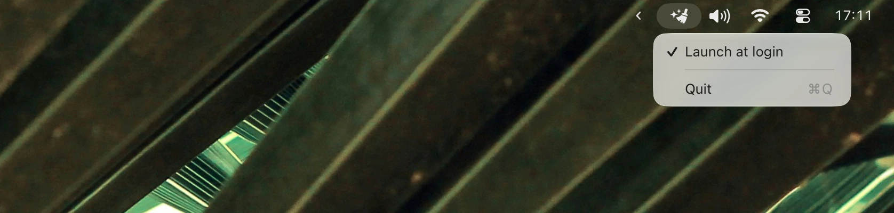

# Unquarantine

A small macOS menu bar app that monitors your `~/Downloads` folder and removes the `com.apple.quarantine`
attribute from new files.



Q: Why?
A: Apple makes it unnecessarily difficult to distribute macOS apps without paying them a $100 ransom every year. Many good developers refuse to play that game, and I am here for their apps. Luckily, all it takes to get them running is removing the quarantine flag.

Q: Is it safe?
A: That depends on what you download. Unquarantine removes quarantine flags automatically; it doesn’t check whether an app is safe. Only run software you trust.

## How to use

Requires macOS 13 or later.

1. Download [Unquarantine.zip](https://github.com/tonsky/unquarantine/releases/latest/download/Unquarantine.zip).
2. Unzip.
3. Ironically, remove the quarantine attribute by running:

```sh
xattr -dr com.apple.quarantine Unquarantine.app
```

4. Move the app to `/Applications`.
5. Launch it.

Hopefully, this is the last time you’ll have to unquarantine anything.

## Attributions

- Idea by [Grishka](https://github.com/grishka)
- Icon by [Sergey Chickin](https://www.sergeychikin.ru/365/)
